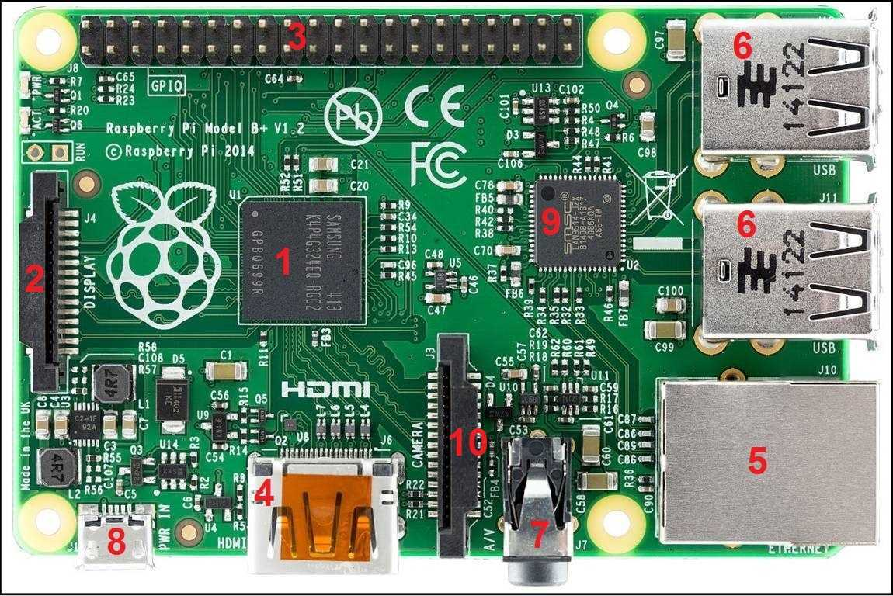

<h1 align="center"> SOC - System On a Chip</h1>

1 - **System on a Chip (SoC)**: Integrated circuit with CPU, memory, RAM, etc...

2 - **Screen conector**: Allows to connect a LCD panel. 

3- **GPIO Pins (in / out)**: Conectors for multiple electronic devices. 1 Byte c/u.

4 - **HDMI**: Connects to a monitor or TV. Both sound and image.

5 - **Ethernet**: Connect your device to the rest of the network.

6 - **USB 2.0:**  Standard to connect peripherals.

7 - **Audio**: 3.5mm connector for speakers.

8 - **Micro-USB power connector**: Source of power for the Raspberry Pi.

9 - **USB and Ethernet interface chip**

10 - **Camera**: Connection for a videocamera.
